  

---

| MY ACHIEVEMENTS |
| :-------------- |

---

| MY TECH |
| :-------------- |

---

| What I Built  |
| :-------------- |
[AI-Chat: An Open Source AI Chat Project](https://github.com/aichat-momo/AI-Chat) (Discontinued)

[HackerNote: An iOS Note-Taking App](https://apps.apple.com/app/hackernote)
